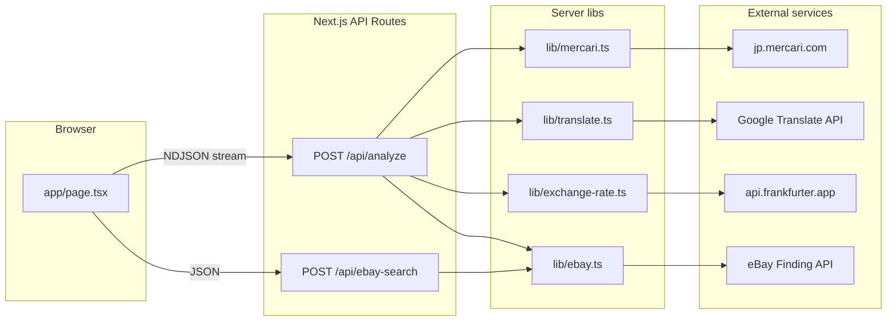

# Compare-app: entrypoints, models, architecture, features

Documentation for **compare-app** (Mercari Compare): a Next.js 16 App Router app that scrapes Mercari JP listings, translates titles, fetches USD/JPY and eBay sold comps, and estimates arbitrage profit after proxy and marketplace fees.

## Runtime and entrypoints

| Surface | Location | Role |
|--------|----------|------|
| **Dev / prod server** | [`package.json`](../package.json) — `next dev`, `next build`, `next start` | Standard Next.js lifecycle. |
| **Root UI** | [`app/layout.tsx`](../app/layout.tsx) | HTML shell, dark theme, imports [`app/globals.css`](../app/globals.css) (Tailwind v4). |
| **Main page (client)** | [`app/page.tsx`](../app/page.tsx) | Sole interactive route: URL form, NDJSON stream consumer, state for Mercari / meta / eBay / errors, re-search without re-scraping. |
| **Analyze pipeline** | [`app/api/analyze/route.ts`](../app/api/analyze/route.ts) | `POST` with `{ url }`; returns **`application/x-ndjson`** (one JSON object per line). |
| **eBay-only search** | [`app/api/ebay-search/route.ts`](../app/api/ebay-search/route.ts) | `POST` with `{ query }`; JSON `{ listings, total_results }`. Used when the user edits the search title. |
| **Deploy** | [`vercel.json`](../vercel.json) | Extends **max duration to 30s** for the analyze route only. |
| **Image domains** | [`next.config.ts`](../next.config.ts) | `remotePatterns` for Mercari and eBay CDNs (used by `next/image` in panels). |

There is no database or auth layer; all data is fetched per request.

---

## Data models

Defined primarily in [`lib/types.ts`](../lib/types.ts):

- **`MercariListing`** — Scraped listing: `title_jp`, `images[]`, `price_jpy`, `condition`, `condition_en`, `seller_rating`, `shipping_included`, `url`.
- **`MercariError`** — `{ error, step: 'mercari' }` (used by scraper error paths; also inline errors in analyze stream).
- **`EbayListing`** — Sold comp: `title`, `price_usd`, `sold_date` (ISO), `condition`, `url`, `thumbnail`.
- **`FeeInputs` / `FeeResult`** — Arbitrage math inputs (Mercari price, rate, Buyee-style fees, intl ship, eBay FVF %, per-order fee, domestic ship) and computed totals, deductions, profits (free-ship vs buyer-pays ship), price stats, break-even.
- **`AnalyzeChunk`** — Discriminated union for the NDJSON stream: `mercari` | `meta` (English title + `usd_rate`) | `ebay` (listings + total) | `error` (message + failing step).

Internal to [`lib/mercari.ts`](../lib/mercari.ts): `MercariItem` mirrors `__NEXT_DATA__` shape before mapping to `MercariListing`.

---

## Architecture

- **Streaming analyze**: The client reads the response body line-by-line and updates UI as each `AnalyzeChunk` arrives ([`app/page.tsx`](../app/page.tsx) `processLine` / `reader.read()` loop).
- **Server sequence** in [`app/api/analyze/route.ts`](../app/api/analyze/route.ts): (1) scrape Mercari → emit `mercari` or `error` and exit; (2) in parallel: translate title + fetch JPY→USD → emit `meta`; (3) `findSoldListings(translatedTitle)` → emit `ebay`; errors map to `error` with `step`.

**Environment variables** (see also [`README.md`](../README.md)):

- `GOOGLE_TRANSLATE_API_KEY` — if missing, [`lib/translate.ts`](../lib/translate.ts) returns original text with `failed: true` (eBay search still runs on Japanese title).
- `EBAY_APP_ID` — if missing, [`lib/ebay.ts`](../lib/ebay.ts) returns **empty array** (UI shows no sold listings; arbitrage bar hidden until comps exist).

**Client-only fee logic**: [`lib/fees.ts`](../lib/fees.ts) runs in the browser inside [`components/ArbitrageBar.tsx`](../components/ArbitrageBar.tsx) from Mercari price, rate, and `EbayListing.price_usd` values.

---

## Feature functionality

1. **Paste Mercari JP URL** — [`components/UrlInput.tsx`](../components/UrlInput.tsx) submits to `/api/analyze`. URL must match `https://jp.mercari.com/item/...` ([`lib/mercari.ts`](../lib/mercari.ts) `isValidMercariUrl`).
2. **Mercari panel** — [`components/MercariPanel.tsx`](../components/MercariPanel.tsx): image, JP title, translated title (or JP fallback), JPY + approximate USD, condition (JP→EN map), seller rating, shipping payer, link out. **Edit** opens `prompt()` and calls `onEditTitle` → client hits `/api/ebay-search` with new query ([`app/page.tsx`](../app/page.tsx) `handleReSearch`).
3. **eBay panel** — [`components/EbayPanel.tsx`](../components/EbayPanel.tsx): up to 20 sold items (pagination in [`lib/ebay.ts`](../lib/ebay.ts)), thumbnails, prices, dates, **edit search** same as above.
4. **Arbitrage bar** — [`components/ArbitrageBar.tsx`](../components/ArbitrageBar.tsx): shows net profit (free-ship primary), best/avg/worst case from high/avg/low sold prices, break-even sale price, editable intl ship / eBay domestic ship / FVF % / per-order fee; compares **free shipping** vs **buyer pays shipping** profit paths using [`calculateFees`](../lib/fees.ts). Shown only when `mercari`, `usdRate`, and non-empty `listings` exist ([`app/page.tsx`](../app/page.tsx)).
5. **Tests** — Vitest ([`vitest.config.ts`](../vitest.config.ts)): [`tests/`](../tests/) cover fees, Mercari, eBay, translate, exchange rate per [`README.md`](../README.md).

**Out of repo app tree**: Untracked root scripts (`check_breakeven.js`, `verify_math.js`, `test_edge.js`, `scripts/debug-mercari.mjs`) are ad-hoc/debug helpers, not wired into the Next.js app.

---

## File map (quick reference)

| Area | Files |
|------|--------|
| App shell + page | [`app/layout.tsx`](../app/layout.tsx), [`app/page.tsx`](../app/page.tsx), [`app/globals.css`](../app/globals.css) |
| API | [`app/api/analyze/route.ts`](../app/api/analyze/route.ts), [`app/api/ebay-search/route.ts`](../app/api/ebay-search/route.ts) |
| Domain logic | [`lib/types.ts`](../lib/types.ts), [`lib/mercari.ts`](../lib/mercari.ts), [`lib/ebay.ts`](../lib/ebay.ts), [`lib/translate.ts`](../lib/translate.ts), [`lib/exchange-rate.ts`](../lib/exchange-rate.ts), [`lib/fees.ts`](../lib/fees.ts) |
| UI | [`components/UrlInput.tsx`](../components/UrlInput.tsx), [`MercariPanel.tsx`](../components/MercariPanel.tsx), [`EbayPanel.tsx`](../components/EbayPanel.tsx), [`ArbitrageBar.tsx`](../components/ArbitrageBar.tsx) |
